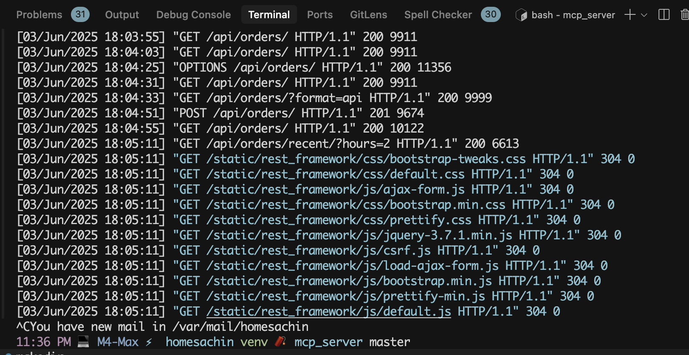
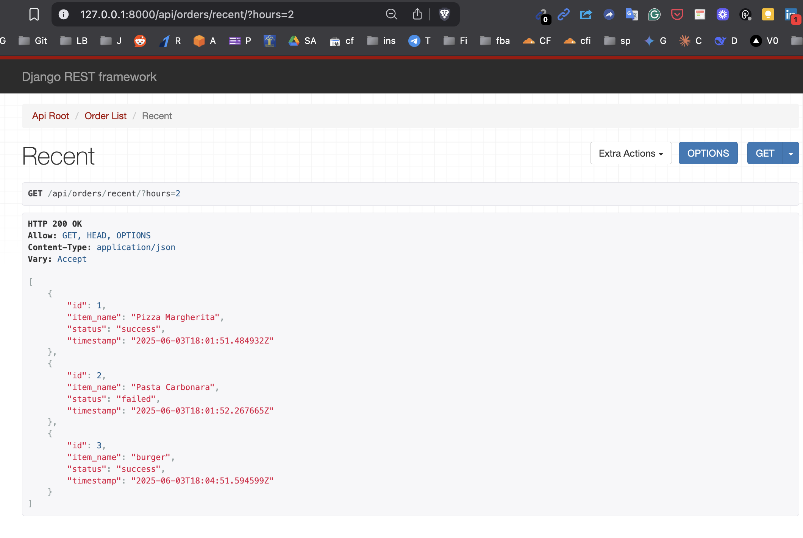

'''
 __  __ _____ _____     _____ ____  _   _ _____ ____
|  \/  | ____|_   _|   | ____|  _ \| | | | ____|  _ \
| |\/| |  _|   | |_____|  _| | |_) | | | |  _| | | | |
| |  | | |___  | |_____| |___|  _ <| |_| | |___| |_| |
|_|  |_|_____| |_|     |_____|_| \_\\___/|_____|____/

'''
# 🍽️ MCP Restaurant Ordering API Server


Welcome to the **MCP-compatible Restaurant API** built with 🐍 Django + 🛠️ Django REST Framework.
Simulate customer orders from a dummy restaurant menu and track their **status** in real-time 🟢/🔴.
Ideal for integration with any MCP server.

---

## 📁 Project Directory

```
├── mcp_server/
│   ├── requirements.txt
│   ├── db.sqlite3
│   ├── README.md
│   ├── .env
│   ├── manage.py
│   ├── orders/
│   │   ├── models.py
│   │   ├── serializers.py
│   │   ├── apps.py
│   │   ├── admin.py
│   │   ├── tests.py
│   │   ├── urls.py
│   │   └── views.py
│   ├── mcp_server/
│   │   ├── asgi.py
│   │   ├── settings.py
│   │   ├── urls.py
│   │   └── wsgi.py
```

---

## 🚀 Quickstart

```bash
# 1. Clone the repo
git clone https://github.com/sachnaror/restaurant-mcp-server.git
cd restaurant-mcp-server

# 2. Setup environment
python -m venv venv
source venv/bin/activate
pip install -r requirements.txt

# 3. Add secrets to `.env`
echo "SECRET_KEY=your_django_secret_key" > .env
echo "DEBUG=True" >> .env

# 4. Run DB & server
python manage.py migrate
python manage.py runserver
```

---

## 🧪 Example Usage (cURL)

```bash
# Create a new order
curl -X POST http://localhost:8000/api/orders/ \
     -H "Content-Type: application/json" \
     -d '{"item_name": "Biryani", "status": "success"}'

# Get recent orders in last 2 hours
curl http://localhost:8000/api/orders/recent/?hours=2
```

---

## 🔌 API Endpoints

Base URL: `http://localhost:8000/api/`

| Method   | Endpoint                          | Description                        | Sample Payload                             |
|----------|-----------------------------------|------------------------------------|--------------------------------------------|
| `POST`   | `/api/orders/`                    | 📝 Place a new order               | `{ "item_name": "Pizza", "status": "success" }` |
| `GET`    | `/api/orders/`                    | 📋 List all orders                 | –                                          |
| `GET`    | `/api/orders/{id}/`             | 🔍 Get single order by ID          | –                                          |
| `PUT`    | `/api/orders/{id}/`             | ✏️ Update an order                 | `{ "item_name": "Burger", "status": "failed" }` |
| `DELETE` | `/api/orders/{id}/`             | 🗑️ Delete an order                 | –                                          |
| `GET`    | `/api/orders/recent/?hours=2`     | ⏱️ Get orders from last 2 hours    | –                                          |

---

## 🧠 Tech Stack

- 🐍 Python 3.11+
- 🧱 Django 5.x
- 🌐 Django REST Framework
- 📁 SQLite (Dev DB)
- 📦 python-dotenv

---

## 🏁 Roadmap (Ideas)

- 🔐 Token-based user authentication (optional)
- 📊 Dashboard for order analytics
- 📥 Webhook or async order processing simulation
- 🧠 OpenAI GPT integration for dynamic menu or chat

---

## 📸 Screenshots





---

## 📩 Contact

| Name              | Details                             |
|------------------|-------------------------------------|
| **👨‍💻 Developer**  | Sachin Arora                        |
| **📧 Email**       | [sachnaror@gmail.com](mailto:sachnaror@gmail.com) |
| **📍 Location**    | Noida, India                        |
| **📂 GitHub**      | [github.com/sachnaror](https://github.com/sachnaror) |
| **🌐 Website**     | [https://about.me/sachin-arora](https://about.me/sachin-arora) |
| **📱 Phone**       | [+91 9560330483](tel:+919560330483) |

---
